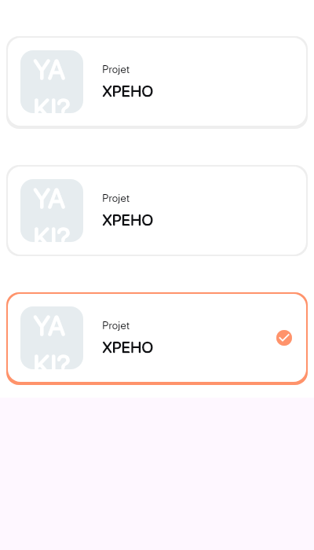
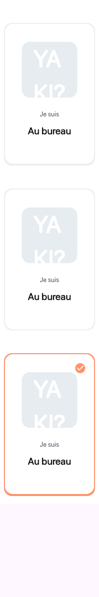

# Yaki UI

This is the UI for the Yaki XPEHO project.

## Getting Started

### Add dependency

```dart
flutter pub add yaki_ui
```

## Components

### Button


**Usage**

```dart
import 'package:yaki_ui/yaki_ui.dart';

// Primary button
class MyWidget extends StatelessWidget {
  @override
  Widget build(BuildContext context) {
    return Button(
      text: 'Button',
      onPressed: () {},
    );
  }
}

// Secondary button
class MyWidget extends StatelessWidget {
  @override
  Widget build(BuildContext context) {
    return Button.secondary(
      text: 'Button',
      onPressed: () {},
    );
  }
}

// Tertiary button
class MyWidget extends StatelessWidget {
  @override
  Widget build(BuildContext context) {
    return Button.tertiary(
      text: 'Button',
      onPressed: () {},
    );
  }
}
```

### Icon chip


**Usage**

```dart
import 'package:yaki_ui/yaki_ui.dart';

// Icon chip
class MyWidget extends StatelessWidget {
  @override
  Widget build(BuildContext context) {
    return IconChip(
      label: 'Hello World !',
      backgroundColor: Colors.blue,
      image: ClipRRect(
        borderRadius: BorderRadius.circular(50),
        child: Image.network(
          'https://picsum.photos/200',
          width: 100,
          height: 100,
        ),
      ),
    );
  }
}
```

### Cell


**Usage**

```dart
import 'package:yaki_ui/yaki_ui.dart';

// Icon chip
class MyWidget extends StatelessWidget {
  @override
  Widget build(BuildContext context) {
    return Cell(
      title: 'Hello World',
      subtitle: 'Welcome to Yaki UI !',
      image: Container(
        height: 48,
        width: 48,
        decoration: BoxDecoration(
          borderRadius: BorderRadius.circular(
            20,
          ),
          image: const DecorationImage(
            image: NetworkImage(
              'https://picsum.photos/200/300',
            ),
            fit: BoxFit.cover,
          ),
        ),
      ),
      chips: const Icon(Icons.abc),
      child: IconChip(
        image: const Icon(Icons.abc),
        label: 'ABC',
        backgroundColor: Colors.grey.shade300,
      ),
    );
  }
}
```

### TeamSelectionCard



**Usage**

```dart
import 'package:yaki_ui/yaki_ui.dart';

// Icon chip
class MyWidget extends StatelessWidget {
  @override
  Widget build(BuildContext context) {
    return TeamSelectionCard(
      picture: Image.network(
        'https://picsum.photos/200',
      ),
      title: 'Yaki',
      subtitle: 'Yaki is a design system',
      onSelectionChanged: (selected) {
        debugPrint('Team selection changed: $selected');
      },
    );
  }
}
```

### InputText


**Usage**

```dart
import 'package:yaki_ui/yaki_ui.dart';

// Icon chip
class MyWidget extends StatelessWidget {
  @override
  Widget build(BuildContext context) {
    return InputText(
      type: InputTextType.email,
      label: 'Email',
      controller: TextEditingController(),
      readOnly: true,
    );
  }
}
```

### LocationSelectionCard



**Usage**

```dart
import 'package:yaki_ui/yaki_ui.dart';
// Icon chip
class MyWidget extends StatelessWidget {
  @override
  Widget build(BuildContext context) {
    return LocationSelectionCard(
      picture: const Icon(Icons.abc),
      title: 'Yaki',
      subtitle: 'Yaki is a design system',
      onSelectionChanged: (selected) {},
    );
  }
}
```

## Widgetbook

This project uses [Widgetbook](https://pub.dev/packages/widgetbook) to document the widgets.

More information about Widgetbook can be found on [widgetbook.io](https://www.widgetbook.io/)
